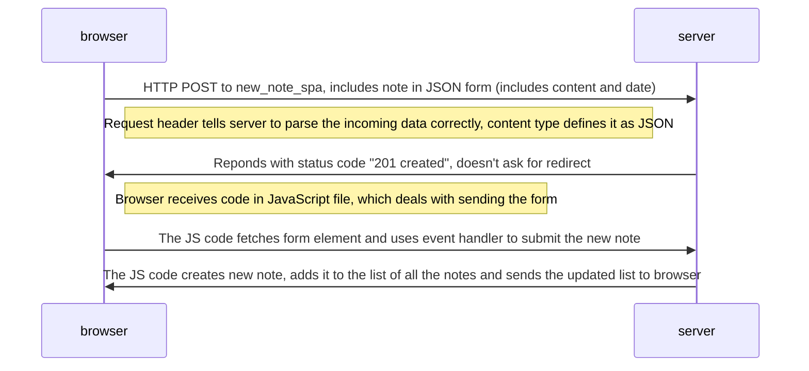

```mermaid
sequenceDiagram
    participant browser
    participant server

    browser->>server: HTTP POST to new_note_spa, includes note in JSON form (includes content and date)
    Note right of browser: Request header tells server to parse the incoming data correctly, content type defines it as JSON 
    server->>browser: Reponds with status code "201 created", doesn't ask for redirect 

    Note right of browser: Browser receives code in JavaScript file, which deals with sending the form
    
    browser->>server: The JS code fetches form element and uses event handler to submit the new note
    server->>browser: The JS code creates new note, adds it to the list of all the notes and sends the updated list to browser 
```
